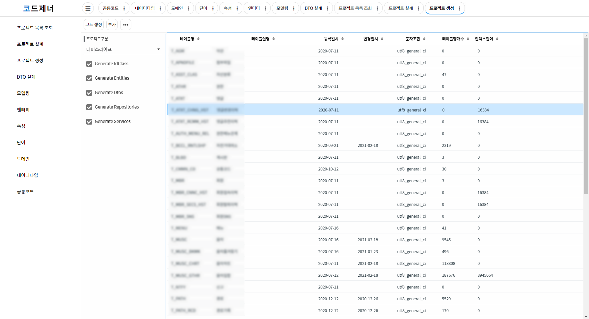
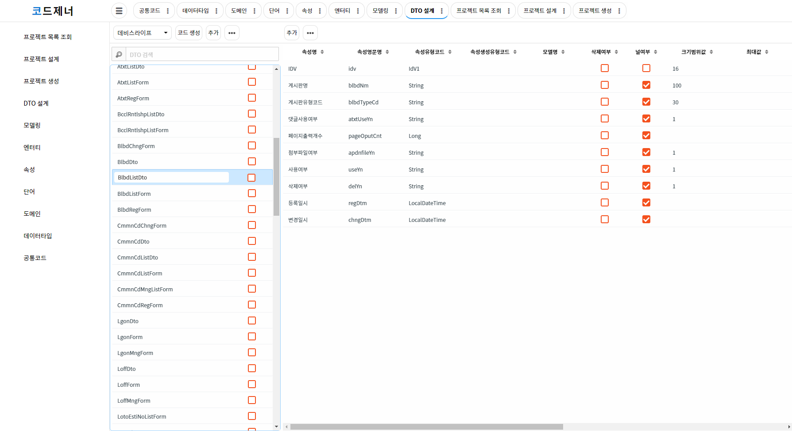
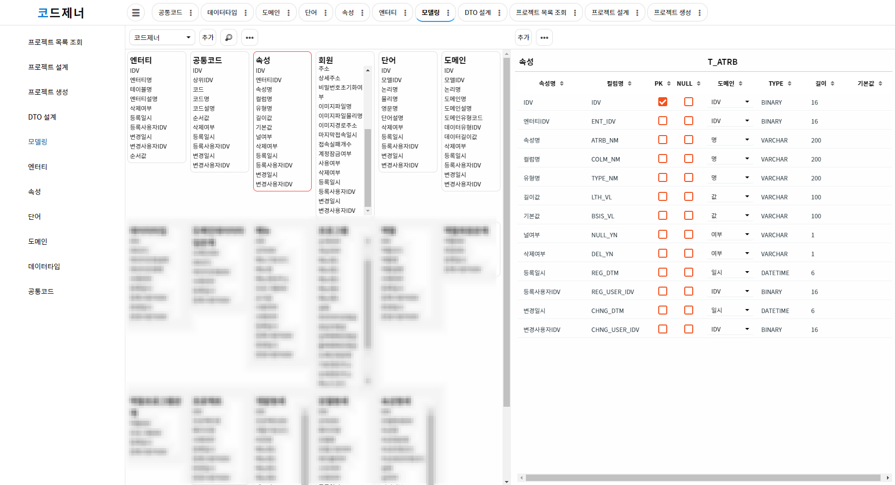

# 코드제너 포트폴리오
> 이 프로젝트는 논리 설계를 기반으로 한 API서버 및 DDL 생성을 목적으로 하는 프로젝트입니다.
> 장기적인 목표는 개발자 및 사업자를 위한 웹 기반 프로젝트 설계 및 솔루션 제공입니다.

## 직무기술
### 인프라
- CentOS7
- Nginx
- Tomcat
- Gitlab
- Nexus OSS
- MySQL 7
- Swagger UI

### 개발
- Java 8
- Spring Boot 2
- JPA (QueryDSL)
- Mybatis
- Vue.js
- Maven
- Lombok

## 구현화면
- 프로젝트 설계 - 사전 정의된 룰에 따라 한글로 메뉴만 작성하면 프로젝트 모델과 연계하여 영문을 포함한 API 프로젝트가 생성된다.

- 프로젝트 생성 - 프로젝트 모델 기준으로 생성 가능한 Service, Repository 코드가 생성된다.

- DTO 설계 - API 요청/응답에 따른 유연성을 고려하여 코드 생성 시 DTO 설계 기준을 우선으로 생성된다.

- 모델링 - 논리모델 설계 기준으로 물리모델 도출과 이에 따른 DDL을 성성할 수 있다. 차후 이를 기반으로 위 코드 생성과 연계하여 프로젝트가 생성될 예정이다.

