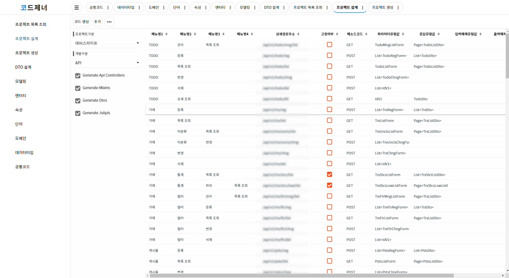

# 코드제너 포트폴리오
> 이 프로젝트는 논리 설계를 기반으로 한 API서버 및 DDL 생성을 목적으로 하는 프로젝트입니다.
> 장기적인 목표는 개발자 및 사업자를 위한 웹 기반 프로젝트 설계 및 솔루션 제공입니다.

## 직무기술
### 인프라
- CentOS7
- Nginx
- Tomcat
- Gitlab
- Nexus OSS
- MySQL 7
- Swagger UI

### 개발
- Java 8
- Spring Boot 2
- JPA (QueryDSL)
- Mybatis
- Vue.js
- Maven
- Lombok

## 구현화면
> 

> 

> 

> 

